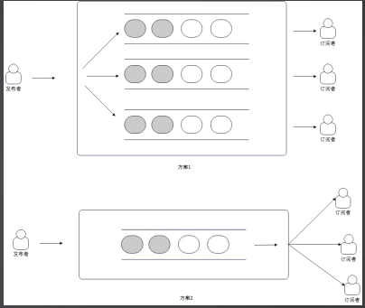

###### Channel

```
channel基本用法
· ch<-x  //发送数据x
· x=<-ch //接收数据，赋给x
· <-ch   //接收数据，并丢弃

利用channel的思路
1.看作是队列，主要用于传递数据
2.利用阻塞特性，可以间接控制goroutine或者其他资源的消耗

发布订阅模式
利用channel实现发布订阅模式，发布者不断往channel里面塞入数据，订阅者从channel里面取出数据。
进程内的事件驱动可以依托于channel来实现
缺陷：
1.没有消费组概念。不能说同一个事件被多个gorountine同时消费，有且只能有一个
2.无法回退，也无法随机消费

实现消息队列
例子：利用channel来实现一个基于内存的消息队列，并且有消费组概念。
思路：难点在于channel里面的元素只能被一个gorotine取出来。要想同一个消息能被多goroutine消费
· 方案一：每一个消费者订阅的时候，创建一个子channel
· 方案二：轮询所有的消费者


实现一个任务池
例子：利用channel来实现一个任务池。该任务池运行开发者提交任务，
并且设定最多多少个goroutine同时运行。
思路：
 1.提交任务的时候，如果执行goroutine满了，任务池是缓存住这个任务，还是直接阻塞提交者？
 2.如何缓存，那么缓存需要多大？缓存满了又该怎么办？

```