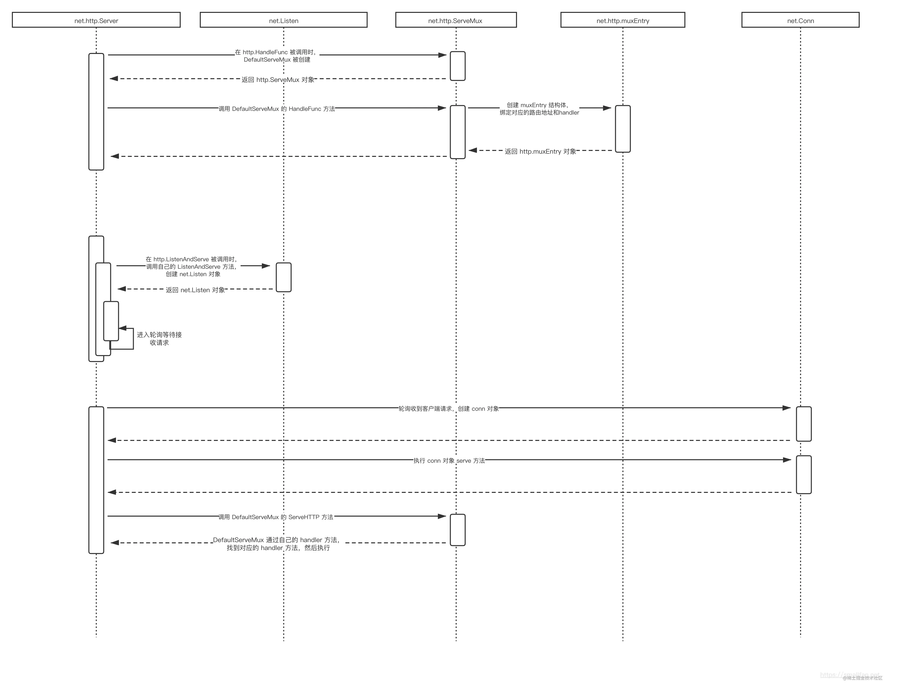

##### http
```
HTTP WEB服务的整体流程大致如下：

1.调用 http.HandleFunc
 · 创建 DefaultServeMux
 · 将上层 handler 方法转换为 HandlerFunc 类型
 · 将转换后的 HandlerFunc 类型生成 muxEntry 对象，然后存入map中

2.调用 ListenAndServe
 · 创建 net.Listener ，并将它加入到自己的追踪map中
 · 轮询 net.Listener 是否接收到来自客户端的请求


3.net.Listener 收到来自客户端的请求

 · 开启一个goroutine，执行 conn 对象的 serve 方法
 · 解析 request 内容，生成 response 对象
 · c.server 寻址到其所对应的 Server 对象，找到 Server.handler对象（默认为DefaultServeMux）
 · 执行 Server 的 Handler 方法，进行match工作（如果找没有路由满足，则调用 NotFoundHandler ）
 · 找到对应的handle方法（实际上是通过 HandleFunc 包装过），执行之
 · 处理结束后，返回对应的 response数据
 · 关闭连接
```
